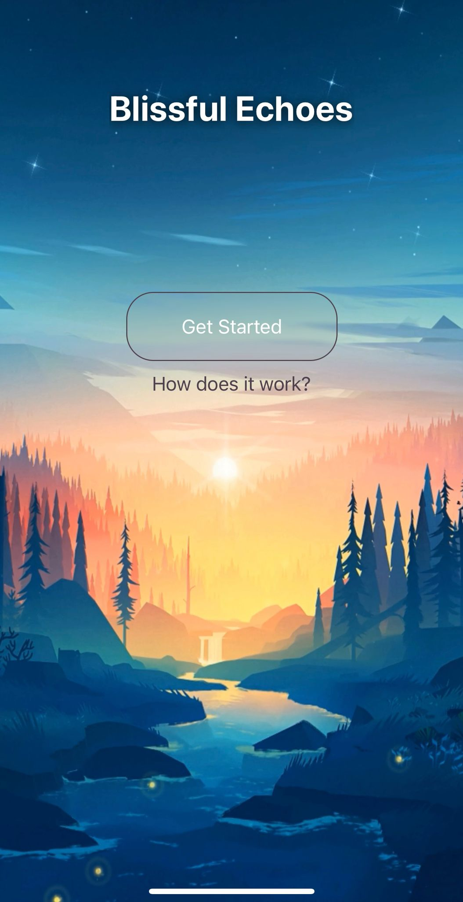
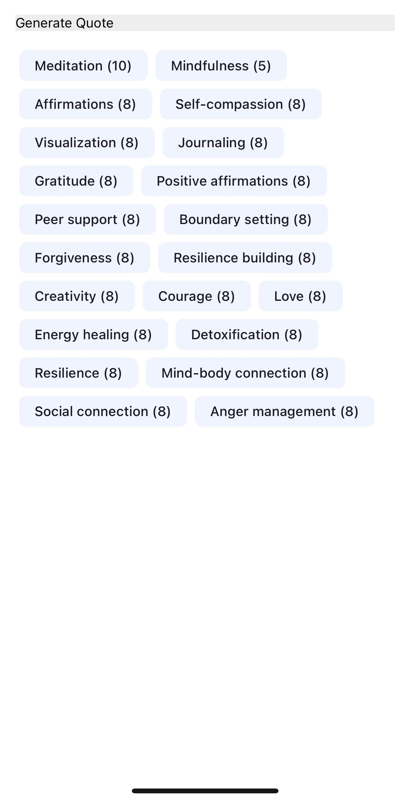

#  🌻 Blissful Echoes  🌻

Blissful Echoes integrates Google's Gemini AI to create bespoke quotes tailored to the user's emotions, preferences, and personal experiences. The app's AI analyzes user inputs and interactions to generate quotes that are not only relevant but also deeply meaningful to each individual, fostering a sense of personal connection and understanding. Focuses on enhancing mental health in the contemporary AI-driven era.

This is a work in progress and information does not reflect final product.

## 🔥 Features 

Blissful Echoes distinguishes itself from typical apps through several key features that leverage the power of AI for emotional engagement and mental wellness:

#### 🍬 AI-Driven Personalization

The core feature of Blissful Echoes is its use of Google's Gemini AI to analyze users' inputs and interactions. Unlike standard apps that offer generic content, Blissful Echoes provides quotes that are uniquely tailored to each user's current emotional state, preferences, and past experiences, making the content significantly more relevant and impactful.

#### 💪 Emotional Intelligence

The app's ability to understand and respond to the user's emotions sets it apart. This emotional intelligence means that the app can offer quotes that are not only contextually appropriate but also emotionally resonant, providing support or inspiration exactly when it's needed.

#### 💫 Mental Health Focus

While many apps aim to entertain or inform, Blissful Echoes places a strong emphasis on enhancing mental health. By offering personalized, meaningful quotes, the app aims to foster a sense of connection, understanding, and positivity, which can be beneficial for users' mental well-being.

#### 💗 User Empowerment:

By providing personalized content, the app empowers users to feel more in control of their emotional well-being. This sense of empowerment is a significant shift from more passive forms of digital interaction, where users consume standard content without any customization.

## 📈 To Do

1) Styling overhaul -- Enhance UI
2) Improve selection of word association - perhaps with a questionnare -- weekly.
3) Deploy and make user friendly for Android and iOs.

## 🔍 Screenshots/Demo

#### Home Page

#### Selection

#### Quote Generation

## 🔨 Built With

-  React Native 
-  Javascript
-  Expo
  
## ❓ The Why

The integration of Google's Gemini AI into the Blissful Echoes app serves a targeted purpose: to craft quotes that resonate on a personal level with each user, acknowledging their unique emotions, preferences, and experiences. This approach leverages AI's capability to analyze vast amounts of data quickly and accurately, which, in this case, includes user inputs and interactions.

#### 📢 Tailored Quotes

By customizing quotes to align with the user's emotions and experiences, the app ensures that the content is more impactful and relevant. Personalized content can evoke stronger emotional responses, leading to greater engagement and satisfaction.

#### 🔎 Analyzing User Inputs and Interactions:

This feature allows the AI to understand the user's current emotional state and preferences. By doing so, the AI can generate quotes that are not just generic but specifically designed to resonate with the user's present circumstances.

#### 👫 Deeply Meaningful Connections

The goal here is to create a sense of understanding and empathy. When users see quotes that reflect their own thoughts and feelings, they are likely to feel seen and understood, which can be comforting and validating.

#### 👌 Focusing on Mental Health

In an era increasingly influenced by AI and technology, maintaining mental health becomes crucial. The app aims to use AI as a tool for good, providing users with content that uplifts, inspires, or offers solace, thus contributing positively to their mental well-being.

#### 👽 Contemporary AI-driven Era:

Recognizing the pervasive influence of AI in our daily lives, Blissful Echoes aims to harness this technology to foster human well-being rather than contribute to stress or detachment.

In essence, Blissful Echoes is leveraging the advanced capabilities of AI to offer a more personalized and emotionally intelligent service, aiming to enhance the user's mental health and well-being in a world where technology often feels impersonal or overwhelming.
